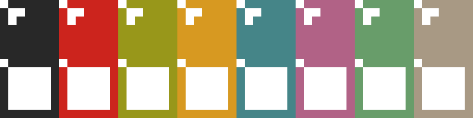

# TetrominoeMaker




Script to generate sprite sheet of NES tetrominoe block.

## Installation

Clone this repository, cd into it and run:

```bash
$ python -m venv .venv # create a virtual environment
$ source .venv/bin/activate # source it, you may need to use another ex, for fish you should use activate.fish
$ pip -r requirements.txt
```

## Usage

```
$ ./tetrominoes_maker.py --help

Usage: tetrominoes_maker.py [OPTIONS]

  Utility to generate sprites of NES tetrominoe.

  Example:
      Generate two files one with two color and one with one color, both with full tetrominoe in the first line
      and empty tetrominoe in the second line.
      `./tetrominoes_maker.py --color #F00000:#AB0000;(0,255,6) --size 40 --fill O.`

Options:
  --color TEXT     Color(s) used to generate the sprite sheet.  [required]
  --size INTEGER   Size of the square
  --width TEXT     Width of the band inside the tetrominoe. If `None` default
                   to `max(size / 7, 2)`
  --fill TEXT      Pattern use to fill the file.
  --outdir TEXT    Output directory.
  --filename TEXT  Output filename(s).
  --help           Show this message and exit.
```
